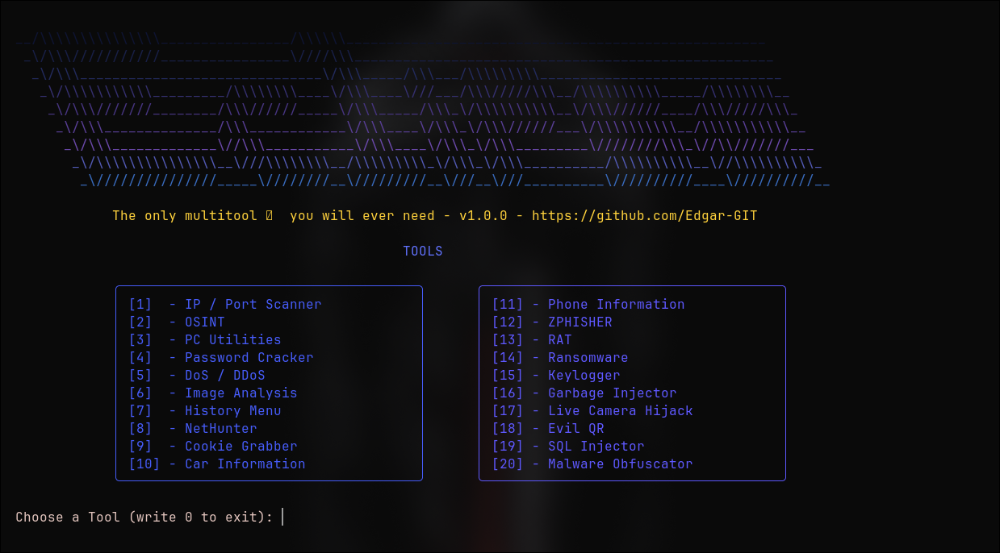

# ECLIPSE - Advanced Security Tool for Professionals



(This tool is currently under development)

## Overview

**ECLIPSE** is a comprehensive, multi-purpose security toolkit designed for cybersecurity professionals, penetration testers, and ethical hackers. Built with **Go** for maximum speed, efficiency, and reliability, ECLIPSE combines multiple reconnaissance, exploitation, and analysis tools into a single, intuitive platform.

## Why Go?

ECLIPSE was developed in **Go** for several critical reasons:

- **⚡ Lightning-Fast Performance**: Go's compiled nature delivers native execution speed, crucial for processing large datasets and network operations
- **🔒 Memory Efficient**: Goroutines enable concurrent operations with minimal resource overhead
- **📦 Single Binary Distribution**: Cross-platform compilation produces standalone executables with zero dependencies
- **🛡️ Built-in Security**: Go's memory safety reduces vulnerabilities common in C/C++ tools
- **🚀 Enterprise-Grade Reliability**: Static typing and concurrency primitives ensure stable, predictable execution

## Features

ECLIPSE provides integrated security workflows covering:

- **Network Reconnaissance**: IP scanning, port scanning, DNS/reverse DNS lookups
- **OSINT**: Username, IP, email, domain, website, and framework-assisted intelligence gathering
- **Web Security**: Cookie analysis and website reconnaissance workflows
- **System Analysis**: PC utilities, Computer reports, Image analysis
- **Exploitation**: Ransomware simulation, Keylogger, SQL Injector, DDoS
- **History & Reporting**: Comprehensive logging and historical analysis across all tools

## Installation

### Windows

```bash
# Download or clone the repository
git clone https://github.com/Edgar-GIT/ECLIPSE.git
cd ECLIPSE

# Ensure Go is installed (https://golang.org/dl)
go version

# Build the executable
go build -o programa.exe

# Run ECLIPSE
./programa.exe
```

### Linux/macOS

```bash
# Clone the repository
git clone https://github.com/Edgar-GIT/ECLIPSE.git
cd ECLIPSE

# Verify Go installation
go version

# Build the executable
go build -o programa

# Make it executable
chmod +x programa

# Run ECLIPSE
./programa
```

## Quick Start

1. **Run the program**:
   ```bash
   ./programa          # Linux/macOS
   programa.exe        # Windows
   ```

2. **Navigate the menu**:
   - Choose one of the displayed tool numbers
   - Type `0` at any time to exit the program

3. **Access History & Reports**:
   - Select option `[7] - History Menu` to view all saved reports and analysis

## Available Tools

1. IP / Port Scanner
2. OSINT
3. DoS / DDoS
4. Image Analysis
5. History Menu
6. NetHunter
7. Cookie Grabber
8. Ransomware
9. Keylogger
10. Garbage Injector
11. Malware Obfuscator

### History Submenu Features

- View Scan Results (IP)
- View Port Scan Results
- OSINT History / Statistics
- View Image Analysis History

## Requirements

- **Go 1.18+** (for building from source)
- **Windows 10+**, **Linux**, or **macOS**
- Internet connection for remote reconnaissance tools
- Standard system libraries

## Legal Notice

**ECLIPSE is designed exclusively for authorized security testing and educational purposes.**

This tool should only be used on systems you own or have explicit permission to test. Unauthorized access to computer systems is illegal.

---

## Stay Ethical! 🛡️

Remember: With great power comes great responsibility. Use ECLIPSE responsibly and ethically.
